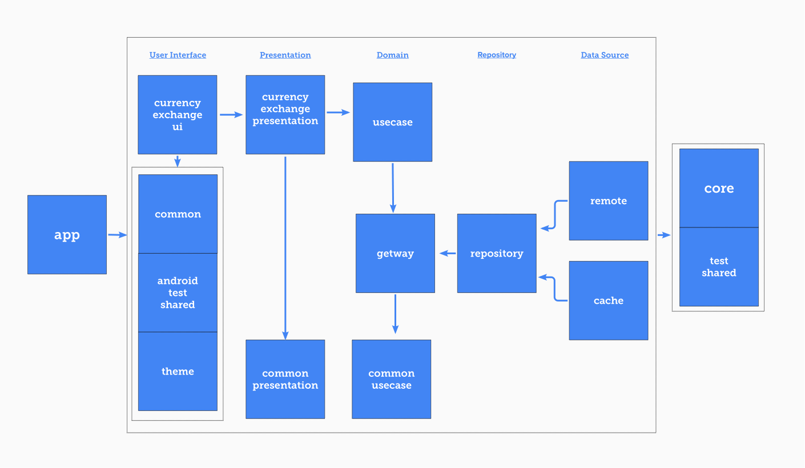

# Currency Rate Exchanger

”Logic will get you from A to B. Imagination will take you everywhere.” - Albert Einstein An

### Summary

This is an Implementation of a native android project with a flexible and maintainable architectural
design using Clean architecture for a `Currency Rate Exchanger` application.

### Key Features:

- 100% Kotlin
- Modular Design
- Clean Architecture
- TDD Based

### Design Structure

Here is the list of technologies that used in this project:

1. UI Layer
    - Compose
    - Ui test
    - Material Design
2. Presentation Layer
    - MVI
    - Flow
    - Orbit library
3. Test Env
    - KoTest
    - Mockk
    - Junit
    - Instrumented tests
    - Ui testing
    - Compose testing
4. Base Features
    - Coroutine
    - KTS
    - Hilt
    - Error Handling
5. Data Layer
    - Room
    - Retrofit
    - Pagination

### Project modular relationships diagram:

- **app:** An orchestra module that has access to all modules to organize dependency injection.
- _common_:
    - **test_shared:** Defined utils for unit tests that can be implemented in every needed module
    - **core:** Some utils that can be used on the whole of the app's structure.
    - **presentation:** Base presentation layer
    - **domain_common:** Common domain utilities of the business layer logic.
- _base_ui_:
    - **common:** Common utilities for the UI layers.
    - **android_test_shared:** Defined utils for android tests that can be implemented in every
      android module
    - **theme:** Theme, styles, colors, dimensions, and other theme-related resources.
- _feature_:
    - **currency_exchange:ui:** Implemented Xml/Compose designs and UI controllers.
    - **currency_exchange:presentation:** A non-UI-related middleman to organize UI events and side
      effects with communications with the domain layer and map their results as a view state.
- _domain_:
    - **domain:gateway:** An interface layer for the domain layer to communicate with the repository
      layer.
    - **domain:use_case:** Implementation of business layer logic.
- _repository_: Implementations of the repository layer
- _datasource_:
    - **cache:** Implementation of the local cache persistence.
    - **remote:** API implementation for taking responsibility for how data are coming from by
      exposing some real or mock data module.

### Advantages:

* **Refactoring**: You can refactor the UI layer and migrate to the classic view system without
  changing even one line of the non-ui-related dependencies
* **Flexibility**: Changing theme and Ui libraries is a fairly straightforward assignment and it
  doesn't affect the top layers.
* **Reus-ability**: Make every single module a third-party library to use in the other projects
* **Testability**: You can separate your dependencies in various modules to make sure about
  dependency cyclic and dependency inversion
* **Responsibility**: Each layer is responsible for its own mission
* **Build speed**: If you change something in your base layers and it doesn't affect the modules
  tree, the derived modules shouldn't be recompiled due to using an interface layer between modules.

### Build Types

**[Staging App Version](app/staging/app-staging.apk)** Used to run Instrumented tests and provide a
testable application with faked data for the testers.

**[Debug App Version](app/debug/app-debug.apk)** is a testable version for developers to find out
bugs and leaks.

**[Release App Version](app/release/app-release.apk)** is a publishable version without developing
dependencies, obfuscated using proguard rules to improve security and minification

### Test Samples:

Some unit test and ui tests and instrumented tests are located here as sample:

* [ExchangerScreenTest](feature/currency_exchange/ui/src/androidTest/java/app/vahid/feature/currency_exchange/ExchangerScreenTest.kt)
* [ExchangerViewModelBehaviorSpec](feature/currency_exchange/presentation/src/test/java/app/vahid/feature/currency_exchange/presentation/entry_list/ExchangerViewModelBehaviorSpec.kt)
* [ConvertCurrencyUseCaseBehaviorSpec](domain/use_case/src/test/java/app/vahid/domain/use_case/ConvertCurrencyUseCaseBehaviorSpec.kt)
* [RemoteResponseMapperBehaviorSpec](datasource/remote/src/test/java/app/vahid/datasource/remote/base/RemoteResponseMapperBehaviorSpec.kt)
* [RoomDatabaseBehaviorSpec](datasource/cache/src/androidTest/java/app/vahid/datasource/cache/database/RoomDatabaseBehaviorSpec.kt)
* [HttpErrorMapperBehaviorSpec](datasource/remote/src/test/java/app/vahid/datasource/remote/base/HttpErrorMapperBehaviorSpec.kt)
* [ApiErrorMapperBehaviorSpec](datasource/remote/src/test/java/app/vahid/datasource/remote/base/ApiErrorMapperBehaviorSpec.kt)
* [OrbitUtilsBehaviorSpec](common/presentation/src/test/java/app/vahid/common/presentation/OrbitUtilsBehaviorSpec.kt)
* [RemoteApiInstrumentedTest](app/src/androidTest/java/app/vahid/RemoteApiInstrumentedTest.kt)

To run tests you can run `gradlew test` and `gradlew connectedAndroidTest` commands.

### Dependencies :

List of all libraries might use in the project.

- org.jetbrains.kotlinx:kotlinx-coroutines-test
- app.cash.turbine:turbine
- io.kotest:kotest-runner-junit5-jvm
- io.kotest:kotest-assertions-core-jvm
- com.google.dagger:hilt-android-testing
- androidx.test.ext:junit
- androidx.test:runner
- androidx.test:rules
- io.mockk:mockk-agent-jvm
- io.mockk:mockk
- org.jetbrains.kotlin:kotlin-reflect
- io.coil-kt:coil-compose
- androidx.compose.foundation:foundation-layout
- androidx.compose.foundation:foundation
- androidx.compose.ui:ui
- androidx.appcompat:appcompat
- androidx.activity:activity-compose
- androidx.compose.material3:material3
- androidx.compose.material:material
- androidx.constraintlayout:constraintlayout-compose
- androidx.lifecycle:lifecycle-runtime-ktx
- androidx.navigation:navigation-compose
- androidx.compose.ui:ui-test-junit4
- androidx.compose.ui:ui-test-manifest
- org.orbit-mvi:orbit-compose
- io.mockk:mockk-android
- androidx.hilt:hilt-navigation-compose
- com.google.accompanist:accompanist-systemuicontroller
- org.orbit-mvi:orbit-viewmodel
- org.orbit-mvi:orbit-test
- androidx.lifecycle:lifecycle-viewmodel-ktx
- androidx.room:room-runtime
- androidx.room:room-paging
- androidx.room:room-compiler
- androidx.room:room-ktx
- org.jetbrains.kotlinx:kotlinx-serialization-json
- com.squareup.retrofit2:retrofit
- com.squareup.okhttp3:okhttp
- com.squareup.okhttp3:logging-interceptor
- com.jakewharton.retrofit:retrofit2-kotlinx-serialization-converter
- com.jakewharton.timber:timber
- com.google.dagger:hilt-android
- com.google.dagger:hilt-android-compiler
- org.jetbrains.kotlinx:kotlinx-coroutines-android
- org.jetbrains.kotlinx:kotlinx-coroutines-core

* If I have more time I try to add some features like Code Quality Measuring tools, Implementing
  CI/CD configurations, Test Coverage Measuring, and some automatic utils to detect lints error and
  certainly, improve test coverage, Auto publish using Fastlane or Jenkins with using taking
  screenshots from the staging mode with its own dummy data.

### Sum up:

For the purpose of providing an overview of my solution, I have only included general information in
this document. My hope is to have the chance to describe my solution and the pros and cons of it
further.